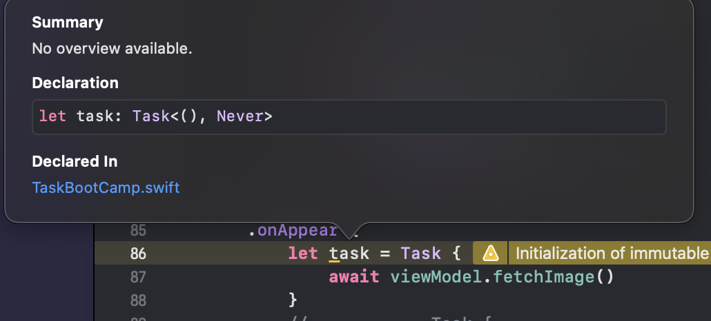
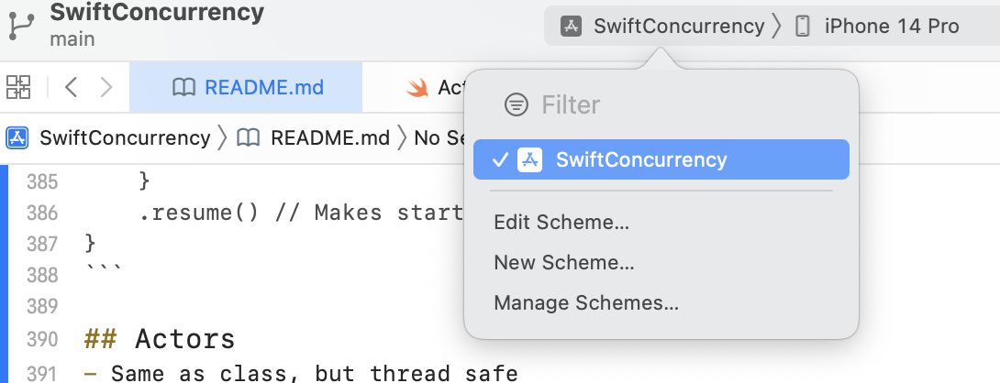
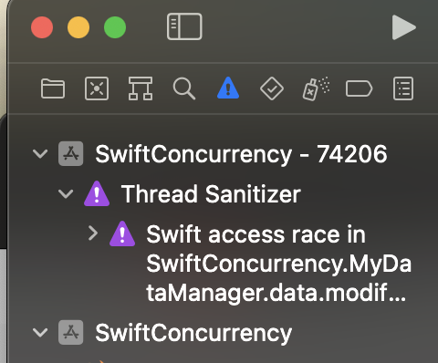
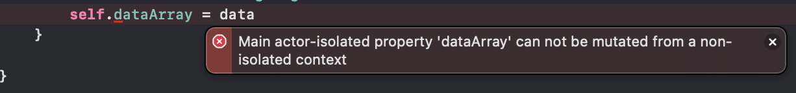

#  SwiftConcurrency
Swift Concurrency notes from the amazing Nick Sarno at Swiftful Thinking: 
https://www.youtube.com/watch?v=ss50RX7F7nE&list=PLwvDm4Vfkdphr2Dl4sY4rS9PLzPdyi8PM&index=2


# Code to Call an Image Asnychronously
From: https://www.youtube.com/watch?v=9fXI6o39jLQ&list=PLwvDm4Vfkdphr2Dl4sY4rS9PLzPdyi8PM&index=4
Code that handles a data response containing an image from an API:
```
func handleResponse(data: Data?, response: URLResponse?) -> UIImage? {
    guard
        let data = data,
        let image = UIImage(data: data),
        let response = response as? HTTPURLResponse,
        // If the above are not there, and the response is not a 2xx code, then return
        response.statusCode <= 200 && response.statusCode < 300 else {
            // If error, then return nil
            return nil
        }
    // If successful, then call the completionHandler with the image
    return image
}
```

Code that asynchronously fetches the image:
```
// Make this an async function with the following keyword
// Throws keyword, allows us to throw an error from here
func downloadWithAsync() async throws -> UIImage? {
    do {
        // Tell the compiler to suspend this task, because its response will arrive later
        let (data, response) = try await URLSession.shared.data(from: url, delegate: nil)
        // Return the UIImage
        return handleResponse(data: data, response: response)
    } catch {
        // If we get an error, we throw it outside this method
        throw error
    }
}
```
Code that calls an image asynchronously in the ViewModel:
```
class DownloadImageAsyncViewModel: ObservableObject {
    
    // Initialize an empty image
    @Published var image: UIImage? = nil
    
    // Reference the image loader
    let loader = DownloadAsyncImageLoader()
    // Set cancellable for combine
    var cancellables = Set<AnyCancellable>()
    
    func fetchImage() async {
        // If you do not care about the image, you can execute the code safely like this
        let image = try? await loader.downloadWithAsync()
        
        // Runs in something similar to the main thread
        await MainActor.run {
            // Set this as the image
            self.image = image
            
        }
    }
}
``` 

Code within the View itself, which allows us to call the image:
```
.onAppear {
    // Task needed to asnychronously call this image
    Task {
        await viewModel.fetchImage()
    }
}
```

# Priority Levels
There are different priority levels for the execution of tasks. If no priority is given to a Task,
then it takes the highest priority level. However, we
can control the priority level for Tasks using a modifier as shown below:
```
Task(priority: .userInitiated) {
    print("USER INITIATED : \(Thread.current) : \(Task.currentPriority)")
} 
```
The higher the TaskPriority number, the more likely it will be prioritized:
```
MEDIUM : <_NSMainThread: 0x600003354000>{number = 1, name = main} : TaskPriority(rawValue: 21)
USER INITIATED : <_NSMainThread: 0x600003354000>{number = 1, name = main} : TaskPriority(rawValue: 25)
HIGH : <_NSMainThread: 0x600003354000>{number = 1, name = main} : TaskPriority(rawValue: 25)
LOW : <_NSMainThread: 0x600003354000>{number = 1, name = main} : TaskPriority(rawValue: 17)
UTILITY : <_NSMainThread: 0x600003354000>{number = 1, name = main} : TaskPriority(rawValue: 17)
BACKGROUND : <_NSMainThread: 0x600003354000>{number = 1, name = main} : TaskPriority(rawValue: 9)
```

If you have a long-runnning operation, then you can let other threads waiting go ahead like this:
```
Task(priority: .userInitiated) {
    
    await Task.yield()
    
    print("USER INITIATED : \(Thread.current) : \(Task.currentPriority)")
}
```

# Cancelling Tasks
If you have a user click through a bunch of pages, you don't want to load images or other data
for the pages the user no longer remains upon. Rather, you need to cancel that Task. 

First grab a reference to the Task. You can do this by defining it up top:
```
task: Task = nil
```
However, that responds in a GenericParameter error (`Generic parameter 'Success' could not be inferred`). Therefore, we 
need to tell it what type of error to make instead. Accomplish this by copying the type shown by `OPTION + CLICKING` an 
object like the below (then you can delete
assignment here):

So the new declaration of the Task becomes like this:
```
let task:  Task<(), Never>? = nil
```

Then change it to match your code as a `@State` property, and set the Task equal to this:
```
@State private var fetchImageTask: Task<(), Never>? = nil 
...
fetchImageTask = Task {
    await viewModel.fetchImage()
}
```

Now, you can add an `onDissapear` modifier to cancel the referenced task:
```
.onDisappear(perform: {
    fetchImageTask?.cancel()
})
```
However, an even smoother method for this brought into iOS 15 is the `.task` modifier, which 
handles all of the code above, the `@State` code, the `.onAppear`, and `.onDisappear` cancellation code in one stroke:
```
.task {
  await viewModel.fetchImage()
}
```

However, for long-running tasks, we might run into the point, where it does not cancel on its own. For these, we need
to check, if the task was cancelled. For example, you might have a loop like this:
```
for image in imageArray {
    try Task.checkCancellation() 
}
```

# Concurrent Execution
In a Task, most of the time, the code runs serially. However, you can use `async let` to run different asynchronous calls at the same time.
Although, this will execute at the same, it will not add the images to the `@State` property until all of the images finish loading.
```
Task {
    do {
        // Execute at same time
        async let fetchImage1 = fetchImage()
        async let fetchImage2 = fetchImage()
        async let fetchImage3 = fetchImage()
        async let fetchImage4 = fetchImage()
        
        // Await all four at same time
        // If any fail, enter the catch block
        let (image1, image2, image3, image4) = await (try fetchImage1, try fetchImage2, try fetchImage3, try fetchImage4)
        
        // If it makes it here, then the images are here
        self.images.append(contentsOf: [image1, image2, image3, image4])
    catch {
    
    }
}
```

# TaskGroups
With TaskGroups, you can more effectively organize multiple asnychronous calls. They still wait until all are complete, like the other, but
this time, you more efficiently write the code:
```
func fetchImagesWithTaskGroup() async throws -> [UIImage] {
    // Create an array of strings
    let urlStrings = [
        "https://picsum.photos/300",
        "https://picsum.photos/300",
        "https://picsum.photos/300",
        "https://picsum.photos/300",
        "https://picsum.photos/300",
    ]
    
   // Return from the outer function the images as well - of portion tells it what to return from the inner function
    return try await withThrowingTaskGroup(of: UIImage?.self) { group in
        // Create blank array to hold returned images
        var images: [UIImage] = []
        
        // Tell compiler how many elements to reserve for this array
        images.reserveCapacity(urlStrings.count)
        
        // Loop through the URLs
        for urlString in urlStrings {
            // Add a groupTask for each one
            group.addTask(priority: .high) {
                try? await self.fetchImage(urlString: urlString)
            }
        }
        
        // Waits for all the tasks to return, if any fail, then it does not run
        for try await image in group {
            if let image = image {
                // Whenever one comes through, it immediately enters group, add it
               images.append(image)
            }
        }
        
        // Waits for all the images to be added, then returns
        return images
    }
}
```
Because we know how many images should be in the array, we can tell the compiler to reserve that amount of space. This 
makes the code more efficient, because it does not have to assume it needs to hold 10,000 images etc. 
```
images.reserveCapacity(urlStrings.count)
```

# Continuations
From: https://www.youtube.com/watch?v=Tw_WLMIfEPQ
Want to run asynchronous code on non-async code? Or code from an SDK you didn't write? You can with Continuations.

See `CheckedContinuationBootcamp` for the full reference file on how to implement this.

With continuations, you must continue exactly once; no more, no less. 
```
func getData2(url: URL) async throws -> Data {
    // Suspends asnychronous context, so it can run non-asynchronous code
    // Must call resume on the continuation at least once
    return try await withCheckedThrowingContinuation { continuation in
        URLSession.shared.dataTask(with: url) { data, response, error in
            // If data never received, then continuation never takes place
            if let data = data {
                // When it finishes here, it continues the task originally in, or resume the continuation and exit this completion handler
                continuation.resume(returning: data)
            }
            // Handle the error, if data did not come back
            else if let error = error {
                continuation.resume(throwing: error)
            }
            // Else if no data returned, and no error returned, then handle this
            else {
                continuation.resume(throwing: URLError(.badServerResponse   ))
            }
        }
        .resume() // Executes the DataTask here
    }
}
``` 
# Types in Memory
From: https://www.youtube.com/watch?v=-JLenSTKEcA
The way classes, structs, strings, integers, and arrays all behave in memory are quite different than each other.
**Value Types**
- Strings, structs,ENUMS, etc. pass the values to other strings or structs.
- Stored in the stack
- Much faster
- Thread safe, because on its own stack for that thread
- New copy of data created/ passed to another variable

**Reference Types**
- Class, function, Actors
- Stored in the heap
- Slower, but synchronized 
- Not thread safe
- Passes a new reference (pointer) to the class

**Stack**
- Last in, first out
  - Add things to the stack, whatever gets added last, must get out first
- Stores value types
- Variables stored directly to memory with fast access 
- Each thread has its own stack 

**Heap**
- Stores reference types
- Shared across threads
- 

## Structs 
- Based on values
- Can be mutated
- Stored in the stack
- Used for data models and Views

When you create a new struct based on an old one, you pass the values of that struct to a new
struct versus passing a reference to the struct as happens with classes.

```
let objectA = MyStruct(title: "Starting title!")
print("ObjectA: ", objectA.title)

print("Passed the VALUES of objectA to objectB")
var objectB = objectA

print("ObjectB: ", objectB.title)

objectB.title = "Second title"
print("ObjectB title changed")

print("ObjectA: ", objectA.title)
print("ObjectB: ", objectB.title)
```
Results in:
```
ObjectA:  Starting title!
ObjectB:  Starting title!
ObjectB title changed
ObjectA:  Starting title!
ObjectB:  Second title

```

Whenevery you modify a struct's contents, you actually modify the entire struct itself/
create a new struct. 

## Classes
- Based on references (instance of class) 
- Cannot be mutated, but change references inside
- Stored in the heap
- Inherit from other classes
- Great for ViewModels

In contrast, when you modify a class, you modify that class in the heap. Therefore, if you set a 
second class equal to a first class, both classes reference the same point in memory.
```
private func classTest1() {
    print("classTest1")
    let objectA = MyClass(title: "Starting title!")
    print("ObjectA: ", objectA.title)
    
    print("Pass the REFERENCES from objectA to objectB")
    let objectB = objectA
    print("ObjectB: ", objectB.title)
    
    // Changes the title inside the object
    objectB.title = "Second title"
    print("ObjectB title changed")
    
    print("ObjectA: ", objectA.title)
    print("ObjectB: ", objectB.title)
}
``` 
Results in:
```
classTest1
ObjectA:  Starting title!
Pass the REFERENCES from objectA to objectB
ObjectB:  Starting title!
ObjectB title changed
ObjectA:  Second title
ObjectB:  Second title
```
Notice in the end that both classes have the same title, even though we only changed the title
for objectB? Because objectB was based on objectA, or based on the reference to objectA (versus passing the values),
they modify the same spot in the heap. 

## Automatic Reference Counting (ARC)
Automatic Reference Counting (ARC) counts how many instances of a class remain in memory. Each object
has its own reference count parameter that knows how many times this object is being used in memory. If two places
in the code are using it, then the ARC should be set at 2. 

This becomes a problem, if some code executes, but the user navigates to a different page. The user no longer cares about the results 
to the previous code. However, that code still fires/ launches, because it is referenced in memory. Therefore, we need
to use weak references, so that the ARC drops to zero, if the user launches to a different page like with this code:
```
func downloadWithEscaping(completionHandler: @escaping (_ image: UIImage?, _ error: Error?) -> ()) {
    // The data task launches as soon as it reaches the code, the portion in braces, executes once data gets returned
    // With weak self, if user is on another page, then don't load this
    URLSession.shared.dataTask(with: url) { [weak self] data, response, error in
        // Returns an image or an optional image
        let image = self?.handleResponse(data: data, response: response)
        
        // If successful, then call the completionHandler with the image
        completionHandler(image, error)
        
    }
    .resume() // Makes start
}
``` 

## Actors
- Same as class, but thread safe
- Must work in async/ in/ out of 
- Great for shared DataManager services, which connects to databases, or makes network calls

Actors are identical to classes, except they are thread-safe. This means that two different pieces of 
code running on two different threads can safely modify the same actor in the heap. In contrast, with classes
one code could erase the class itself, while another wanted to change a portion of it. 

# Actor Helpfullness 
From: https://www.youtube.com/watch?v=UUdi137FySk
## Data Race
The file `ActorsBootcamp` simmulates what happens, if different threads try updating the same referenced
class at the same time.

## Thread Sanitizer
The Thread Sanitizer within Xcode (off by default) can help us realize any thread-potential problems updating our app.

Turn it on by clicking the project icon at the top -> edit scheme. Then check the box for the Thread Sanitizer under the Run section:



If you run it again, if there are problems with threads, then you will likely see a print-out like this in the debug console:
```
WARNING: ThreadSanitizer: Swift access race (pid=74206)
  Modifying access of Swift variable at 0x000110451590 by thread T7:
    #0 MyDataManager.data.modify <compiler-generated> (SwiftConcurrency:arm64+0x10001b864)
    #1 MyDataManager.getRandomData() ActorsBootcamp.swift:18 (SwiftConcurrency:arm64+0x10001ba3c)
    #2 closure #1 in closure #2 in HomeView.body.getter ActorsBootcamp.swift:49 (SwiftConcurrency:arm64+0x10001db64)
    #3 partial apply for closure #1 in closure #2 in HomeView.body.getter <compiler-generated> (SwiftConcurrency:arm64+0x100023cf0)
    #4 thunk for @escaping @callee_guaranteed () -> () <compiler-generated> (SwiftConcurrency:arm64+0x10001dee8)
    #5 __tsan::invoke_and_release_block(void*) <null>:17526628 (libclang_rt.tsan_iossim_dynamic.dylib:arm64+0x7b690)
<NSThread: 0x10f8453c0>{number = 3, name = (null)}
    #6 _dispatch_client_callout <null>:17526628 (libdispatch.dylib:arm64+0x5d58)

  Previous modifying access of Swift variable at 0x000110451590 by thread T6:
    #0 MyDataManager.data.modify <compiler-generated> (SwiftConcurrency:arm64+0x10001b864)
<NSThread: 0x10f8453c0>{number = 3, name = (null)}
    #1 MyDataManager.getRandomData() ActorsBootcamp.swift:18 (SwiftConcurrency:arm64+0x10001ba3c)
    #2 closure #1 in closure #2 in BrowseView.body.getter ActorsBootcamp.swift:77 (SwiftConcurrency:arm64+0x1000204ec)
    #3 partial apply for closure #1 in closure #2 in BrowseView.body.getter <compiler-generated> (SwiftConcurrency:arm64+0x1000236c4)
    #4 thunk for @escaping @callee_guaranteed () -> () <compiler-generated> (SwiftConcurrency:arm64+0x10001dee8)
    #5 __tsan::invoke_and_release_block(void*) <null>:17526628 (libclang_rt.tsan_iossim_dynamic.dylib:arm64+0x7b690)
    #6 _dispatch_client_callout <null>:17526628 (libdispatch.dylib:arm64+0x5d58)
    
  Thread T7 (tid=3869876, running) is a GCD worker thread

  Thread T6 (tid=3869875, running) is a GCD worker thread

SUMMARY: ThreadSanitizer: Swift access race <compiler-generated> in MyDataManager.data.modify
```

Better yet, under the warnings, it will show us where the data race occurs. A data race means two threads
are modifying the same place (pointer like 0x000110451590 shown above) on the heap:



### Fix for Thread Race
You can implement a custom lock with a completion handler in order to ensure only one thread can 
access the same pointer in the heap at a given time. All of the threads must queue up to use the single lock:
```
let lock = DispatchQueue(label: "com.MyApp.MyDataManager")

// Escaping closure captures non-escaping parameter 'completionHandler' - need to declare the completionHandler as escaping
func getRandomData(completionHandler: @escaping (_ title: String?) -> ()) { // Returns Void now, except completionHandler returned
    // Uses the queue above in the debugger
    lock.async {
        self.data.append(UUID().uuidString)
        print(Thread.current)
        
        // Return a random element from the array
//            return self.data.randomElement()
        // Returns the data via the completionHandler here
        completionHandler(self.data.randomElement())
    }
}
```
### Asynchronous Fix for Thread Race
Meanwhile, the new actor can do the same code asynchronously like this:
```
actor MyActorDataManager {
    // Make this class a singleton (not recommended like this)
    static let instance = MyActorDataManager()
    private init() {}
    
    var data: [String] = []
  
    func getRandomData() -> String? { // Returns Void now, except completionHandler returned
            self.data.append(UUID().uuidString)
            print(Thread.current)
            return self.data.randomElement()
    }
}
```
Then you call the async code to update the title state object like this:
```
// Every 0.1 seconds we receive new value from the timer publisher
.onReceive(timer) { _ in // Does nothing with new value
    
    Task {
        // Call the asynchronous function
        if let title = await manager.getRandomData() {
            await MainActor.run(body: {
                self.text = title
            })
        }
    }
}
```
### Pieces not Async
If you want a portion of your Actor to not be asynchronous, then you can change it so that you do not need to wait for it like this:
```
nonisolated func getSavedData() -> String {
    return "NEW DATA"
}
```
Similarly if you want a property outside of the asynchronous context, then you can define that like this:
```
nonisolated let myRandomText = "asdfsdfa"
```
# Global Actors
From: https://www.youtube.com/watch?v=BRBhMrJj5f4
You can create your own custom global actor in order to safely execute code on the same thread like this:
```
@globalActor struct MyFirstGlobalActor {
    // Conforms to the GlobalActor protocol through a shared instance of the actor MyNewDataManager
    static var shared = MyNewDataManager()
}

actor MyNewDataManager {
    
    func getDataFromDatabase() -> [String] {
        return ["One", "Two", "Three", "Four", "Five"]
    }
}

```
Then, it's possible to use a custom decorator to isolate asynchronous methods only to that actor:
```
    // Access the actor via a reference to the singleton
    let manager = MyFirstGlobalActor.shared
    
    // Only allow this to run within the global actor via isolation
    @MyFirstGlobalActor func getData() async {
        // HEAVY COMPLEX METHODS
        
        // Get the array of strings from the database
        let data = await manager.getDataFromDatabase()
        self.dataArray = data
    }

```
In addition, you can ensure that code runs on the main thread via the `MainActor` (also a global actor):
```
@MainActor
func getData() {
    // HEAVY COMPLEX METHODS
    Task {
        // Get the array of strings from the database
        let data = manager.getDataFromDatabase()
        self.dataArray = data
    }
}
```
In order to update UI code safely, you need to be on the `MainActor` you can enforce this/ generate warnings about this
by using the decorator before the `@Published` property:
```
@MainActor @Published var dataArray: [String] = []
```
This will then create compiler errors, whenever we update this not on the main thread:
```
@MainActor @Published var dataArray: [String] = []
```


# Sendable Protocol 
From: https://www.youtube.com/watch?v=wSmTbtOwgbE
The Sendable protocol makes it so that non-thread-safe classes can be sent into thread-safe Actors.
Otherwise, you could pass an actor a class, then a portion of code could update the class elsewhere, and
cause issues.

You can mark structs and classes as Sendable by having them conform to the Sendable protocol like this:
```
struct MyUserInfo: Sendable {
    let name: String
    
}
```
Meanwhile, you need to make a class final, if you want it to conform to the sendable protocol. In the example,
all of the variables are `let` constants, so they will never change within this class.
```
// Final class prevents other classes from inheriting from this class, which allows
// it to conform to the sendable protocol
final class MyClassUserInfo: Sendable {
    let name: String
    
    // Create an initializer for the class as required
    init(name: String) {
        self.name = name
    }
}
```
Meanwhile, if you want to have a class with mutable properties (`var`s versus `let` constants), you must create
your own queue, or lock, which forces only one thread to update the properties at a time. Therefore, two threads 
cannot mess with the class simultaneously. You make it, so that the property cannot be changed like normal either
through the use of a `private var`.

Note that you also mark it as an unchecked Sendable protocol to tell the compiler that you will check this yourself.
```
final class MyClassUserInfo: @unchecked Sendable {
   private  var name: String
    
    let queue = DispatchQueue(label: "com.MyAppName.MyClassUserInfo")
    
    // Create an initializer for the class as required
    init(name: String) {
        self.name = name
    }
    
    func updateName(newName: String) {
        // Only update the code on its own queue (lock)
        queue.async {
            self.name = newName
        }
    }
}
```

However, Nick does not recommend this approach. Rather, you should use `struct`s instead. There may also be
a performance benefit to marking your `struct`s, which are thread-safe by default as value-types as conforming
to the Sendable protocol. 

# Convert @Published to Async
From: https://www.youtube.com/watch?v=ePPm2ftSVqw. See `AsyncPublisherBootcamp.swift` for the full code.

You can make the values of @Published properties asynchronous in the following fashion.
 
Separate class, which updates a property asynchronously:
```
class AsyncPublisherDataManager {
    @Published var myData: [String] = []
    
    func addData() async {
        myData.append("Apple")
        try? await Task.sleep(nanoseconds: 2_000_000_000)
        myData.append("Cherry")
        try? await Task.sleep(nanoseconds: 2_000_000_000)
        myData.append("Bannana")
        try? await Task.sleep(nanoseconds: 2_000_000_000)
        myData.append("Watermellon")
    }
}
```

Another class, which has a property listen to changes in the `myData` property in the first class. Note
the `for` loop below, which contains the core code needed to subscribe to the manager's dataArray property.
```
class AsyncPublisherBootcampViewModel: ObservableObject {
    // Makes it, so this always gets updated on the MainActor
    @MainActor @Published var dataArray: [String] = []
    let manager = AsyncPublisherDataManager()
    
    // Used for Combine
    var cancellables = Set<AnyCancellable>()
    
    init() {
        addSubscribers()
    }
    
    // This will update the published dataArray as information comes into it
    // It subscribes to the myDataArray for any changes
    private func addSubscribers() {
        Task {
            // Subscribes to the Publisher asynchronously
            // Unlike normal for loop that executes immediately, this one awaits each value first
            for await value in manager.$myData.values {
                await MainActor.run {
                    self.dataArray = value
                }
            }
        }
    }
``` 
However, you should also note that unless you add a break to the for loop, it will never stop, nor execute any code
beneath it in the method.

Therefore, if you need to subscribe to multiple properties, then you can create a separate `Task` to perform this work.

